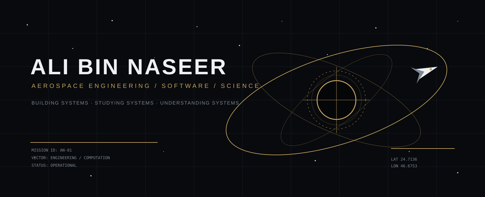
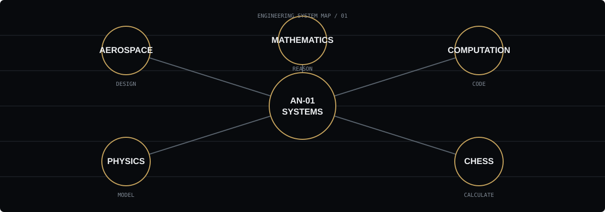
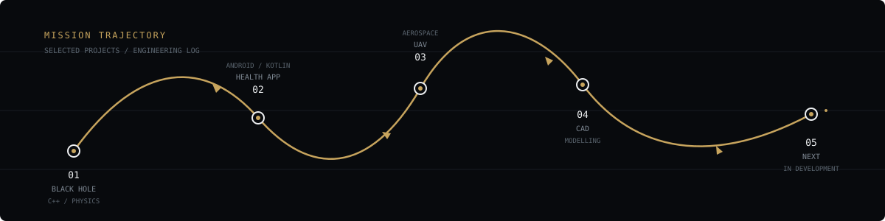
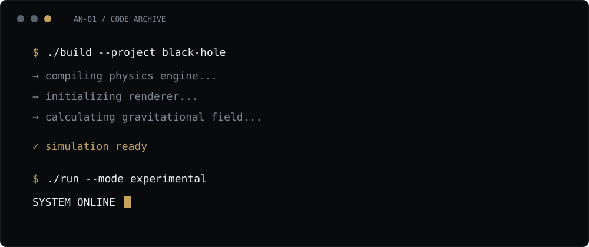
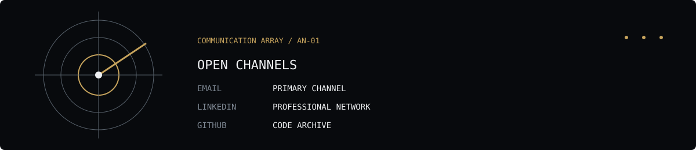

 

### AEROSPACE ENGINEERING · SOFTWARE · PHYSICS · SYSTEMS

I build things to understand how they work.

 

[**PROJECTS**](#selected-missions) · [**EXPERIENCE**](#experience) · [**CODE**](#code-archive) · [**FIELD NOTES**](#field-notes) · [**CONTACT**](#contact)

 

---

## SELECTED MISSIONS

> **The goal isn't to collect technologies.**
> **The goal is to understand systems deeply enough to build with them.**

### `01` — BLACK HOLE / GRAVITATIONAL LENSING

**C++ · OpenGL · GLM · Physics**

A real-time 3D experiment exploring gravitational lensing and the visual behaviour of light around a black hole.

`PHYSICS` `COMPUTATION` `3D GRAPHICS`

---

### `02` — NUST HEALTH APP

**Android · Kotlin · Jetpack Compose · Health Connect**

A campus-oriented activity tracker concept built around walking, step history, goals, streaks, achievements and departmental competition.

`MOBILE` `HEALTH DATA` `UI/UX`

---

### `03` — UAV / AEROSPACE SYSTEMS

**Aerospace Engineering · CAD · Simulation**

Hands-on engineering work exploring aircraft/UAV systems, modelling and the relationship between theoretical engineering and physical machines.

`AEROSPACE` `CAD` `SYSTEMS`

---

### `04` — WORDLE ENGINE

**C++ · Algorithms · Data Structures**

A compact game implementation developed as a team project, with an emphasis on algorithmic thinking and clean program structure.

`C++` `ALGORITHMS` `TEAM PROJECT`

 

---

## EXPERIENCE

### `AEROSPACE`

**Aerospace Engineering — NUST**

Studying aerospace engineering while building a parallel foundation in programming, mathematics, physics, computational tools and engineering design.

---

### `INDUSTRIAL`

**Engineering Internship — HIT Taxila**

Exposure to an industrial engineering environment and the practical side of engineering beyond university coursework.

---

### `SOFTWARE`

**Independent Engineering Projects**

Building software as a way of learning engineering concepts rather than treating programming as a separate discipline.

Current interests include computational physics, simulation, automation, scientific programming and interactive engineering tools.

---

## ENGINEERING STACK

<table>
<tr>
<td width="50%" valign="top">

### COMPUTATION

`Python`
`C++`
`JavaScript / TypeScript`
`MATLAB`

</td>

<td width="50%" valign="top">

### ENGINEERING

`SolidWorks`
`CATIA`
`CAD`
`Physics & Mathematics`
`Simulation`

</td>
</tr>

<tr>
<td width="50%" valign="top">

### WEB

`React`
`Next.js`
`Tailwind CSS`
`Git / GitHub`

</td>

<td width="50%" valign="top">

### CURRENTLY EXPLORING

`Computational Physics`
`3D Simulation`
`Aerospace Systems`
`AI`
`Scientific Computing`

</td>
</tr>
</table>

---

## CODE ARCHIVE

Most of my repositories are experiments, learning projects and engineering prototypes.

I prefer building something difficult enough that the implementation forces me to understand the underlying idea.

**→ [Explore the repository archive](https://github.com/YOUR_GITHUB_USERNAME?tab=repositories)**

 

---

## FIELD NOTES

I also document ideas, experiments, lessons and things I'm currently learning.

**LinkedIn →**
https://www.linkedin.com/in/ali-bin-naseer/

 

<table>
<tr>
<td width="33%" valign="top">

**ENGINEERING**

Aircraft.
Space systems.
Simulation.
CAD.
Physics.

</td>

<td width="33%" valign="top">

**COMPUTATION**

Algorithms.
Programming.
Scientific computing.
AI.
Automation.

</td>

<td width="33%" valign="top">

**OUTSIDE THE LAB**

Chess.
Mathematics.
Books.
Arabic.
Ideas.

</td>
</tr>
</table>

---

 

### CHESS IS PART OF THE TRAINING

Pattern recognition.
Calculation.
Decision making.
Long-term planning.

**Different board. Same engineering mindset.**

---

## CONTACT

### OPEN CHANNELS

**EMAIL** · YOUR_EMAIL
**LINKEDIN** · [ali-bin-naseer](https://www.linkedin.com/in/ali-bin-naseer/)
**GITHUB** · [YOUR_GITHUB_USERNAME](https://github.com/YOUR_GITHUB_USERNAME)

 

For engineering, research, projects, collaboration or interesting problems.

  

`AN-01` · `SYSTEMS ONLINE` · `END OF TRANSMISSION`

